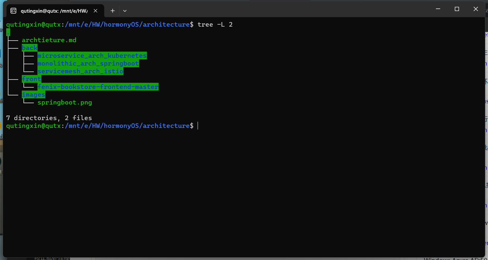
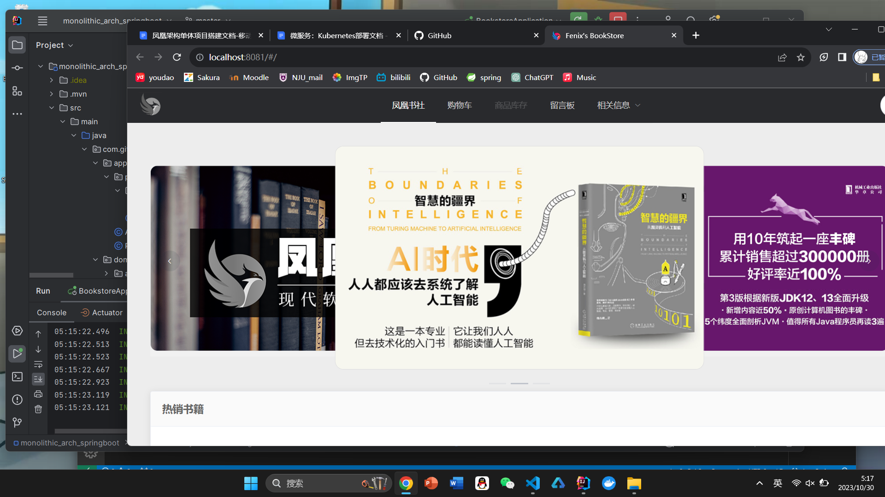
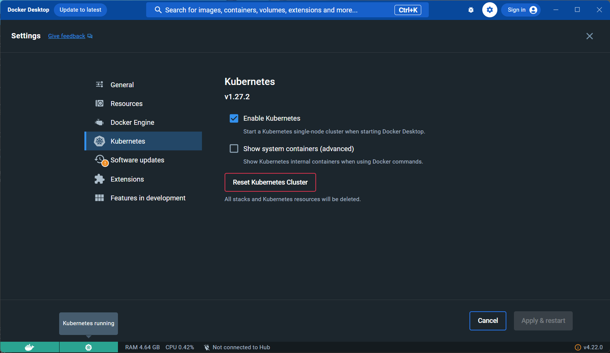
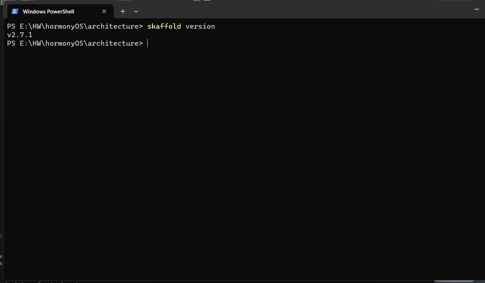
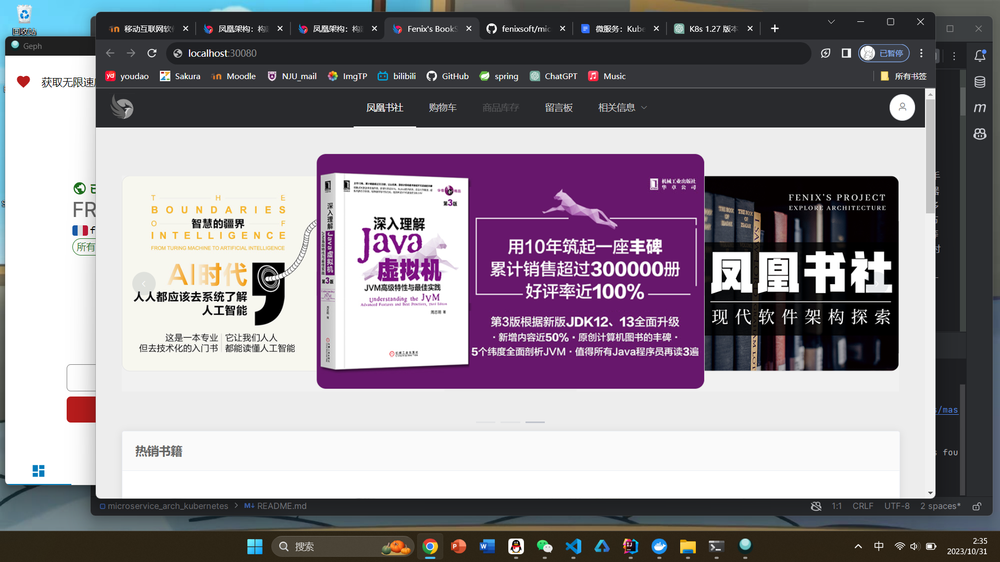
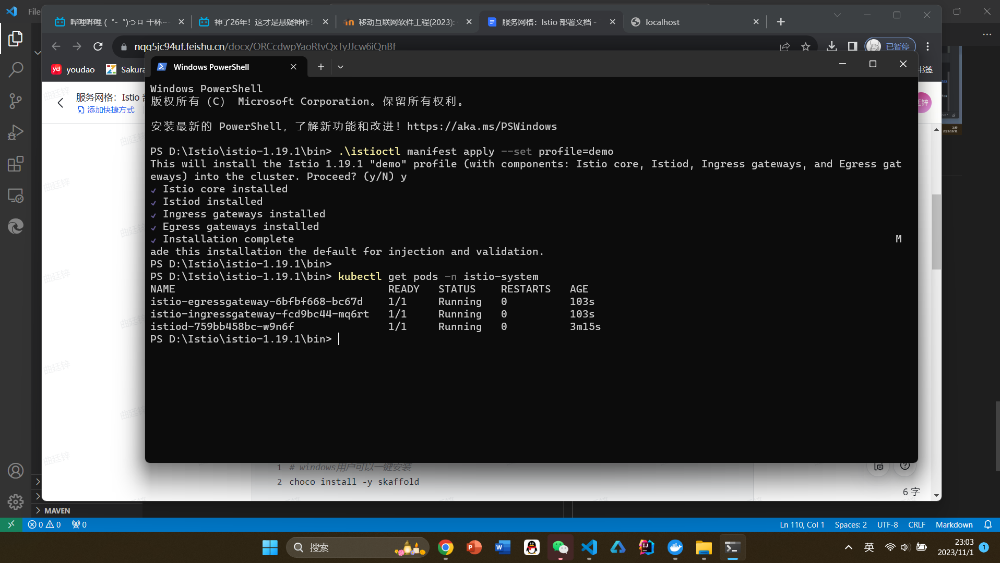
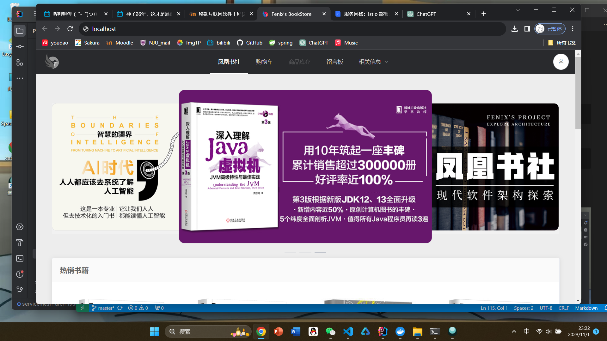

<div align = "center"><font size="6" ><b>Fenix's BookStore</b></font></div>

<br>

<div align = "center"><font size="5" ><b>目录</b></font></div>

- [**0. 开始之前**](#0-开始之前)
  - [个人信息](#基本信息)
  - [clone代码](#clone代码)

- [**1. spring boot单体实现**](#1-spring-boot单体实现)
  - [1.1 修改前端代码](#11-修改前端代码)
  - [1.2 修改后端配置文件](#12-修改后端配置文件)
  - [1.3 通过端口8081打开网页](#13-通过端口8081打开网页)

- [**2. k8s部署**](#2-k8s部署)
  - [2.1 环境配置](#21-环境配置)
  - [2.2 修改代码](#22-修改代码)
  - [2.3 打包编译](#23-打包编译)
  - [2.4 启动skaffold](#24-启动skaffold)
  - [2.5 通过端口***30080***打开网页](#25-通过端口30080打开网页)

- [**3. Istio 服务网格架构**](#3-istio-服务网格架构)
  - [3.1 环境配置](#31-环境配置)
  - [3.2 修改代码](#32-修改代码)
  - [3.3 打包编译](#33-打包编译)
  - [3.4 部署运行](#34-部署运行)

## 0. 开始之前
### 基本信息
|个人信息||
|---|---|
|姓名|曲廷锌|
|学号|211250183|

### clone代码
代码结构如下


## 1. spring boot单体实现
### 1.1 修改前端代码
#### 1.1.1 关闭Mock数据模式
```        
config/dev.env.js 

module.exports = merge(prodEnv, {
  NODE_ENV: '"development"',
  MOCK: false 
})
```
#### 1.1.2 将请求发给后端
``` 
config/index.js

proxyTable: { 
        '/restful': {
            target: 'http://127.0.0.1:8080',
            changeOrigin: true,
            pathRewrite: {
            '^/restful': '/restful'
            }
        },
        '/oauth': {
            target: 'http://127.0.0.1:8080',
            changeOrigin: true,
            pathRewrite: {
            '^/oauth': '/oauth'
            }
        }
        },
```

### 1.2 修改后端配置文件
```
database: mysql

spring:
  datasource:
    url:"jdbc:mysql://127.0.0.1:3306/bookstore?useUnicode=true&characterEncoding=utf-8"
    username: "test"
    password: "123456"
    initialization-mode: always
  
  profiles:
    active: mysql
```
新建一个Mysql用户 **test**（pw:123456）来完成此次实验  
通过spring.profiles.active=mysql指定配置文件

### 1.3 通过端口8081打开网页
使用系统预置的用户（user:icyfenix，pw:123456）登录凤凰书城<br>
运行截图<br>


<br>

## **2. k8s部署**
### 2.1 环境配置
1) 下载Docker DeskTop
2) 开启k8s

3) 安装skaffold


### 2.2 修改代码
因为我的k8s版本是v1.27.2 大于1.22，对代码作出修改

  将项目根目录下的bookstore.yml 和 bookstore-kubernetes-manifests目录下的bookstore-role.yml bookstore-rolebinding.yml kustomization.yaml中的apiVersion 对应的 rbac.authorization.k8s.io/v1beta1全部替换为rbac.authorization.k8s.io/v1
  --来自手册

### 2.3 打包编译
```
./mvnw package
```

### 2.4 启动skaffold
```
skaffold dev
```
启动Skaffold,自动打包Docker镜像，并部署到Kubernetes中

### 2.5 通过端口***30080***打开网页



## 3. Istio 服务网格架构
### 3.1 环境配置
与K8s部署类似，新增Istio安装


### 3.2 修改代码
与k8s的处理类似，调整apiVersion来适应更新的k8s版本

### 3.3 打包编译
```
./mvnw package
```

### 3.4 部署运行
```
skaffold dev
```
